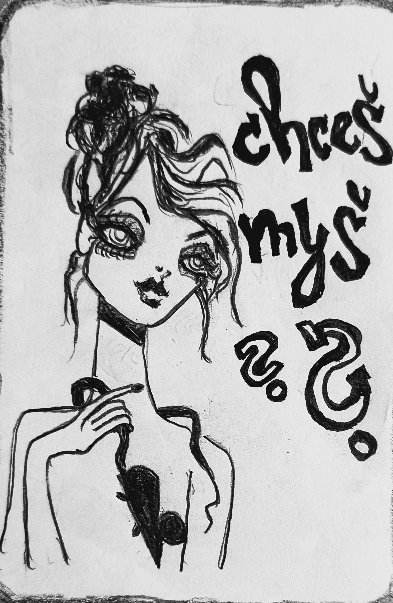
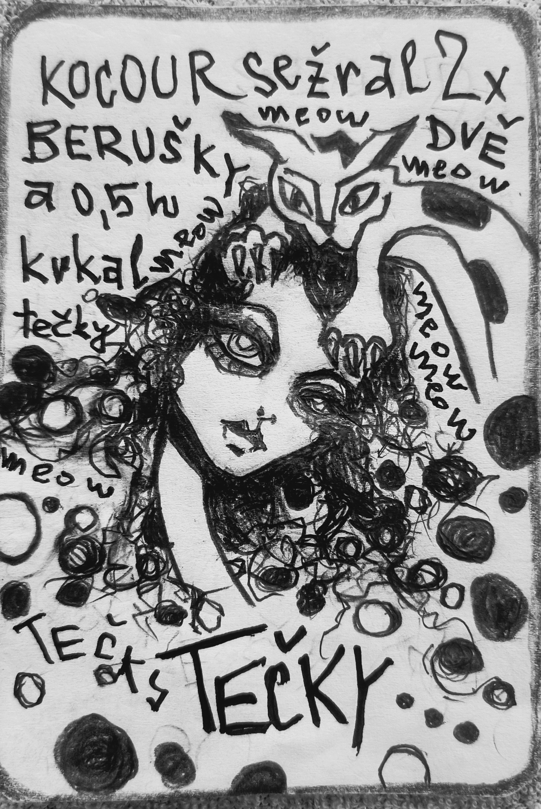

# 🐁 DO YOU WANT A MOUSE? – a dictionary of gaps

**A generative system for diagnosing and resolving team dysfunctions.**

A set of working cards that help teams quickly name the problems that usually go unspoken.  
The cards work as visual and linguistic anchors — **they open conversations that would otherwise never happen.**

---

 
**One story. Twelve truths.**
 

Choose a perspective and read the same story twelve different ways.

👉 <a href="./home/MOUSE/index.html">ABOUT THE MOUSE – See it through 12 angles</a>

 

# 🔥 "You can't get it wrong"

> **You don't need to assign the angles precisely.**
> All of them point at the same problem — and that problem gets addressed either way.
> Even an "imprecise" map reveals something useful.

---

## 🫗 Why this exists

**Most team problems don't come from people — they come from gaps:**

- between expectation and reality
- between what is said and what is meant
- between role and responsibility
- between plan and capacity
- between task and purpose

**The cards make these gaps visible.  
And once you can see the problem, you can solve it.**

Each card represents one type of dysfunction — **a gap in communication.**  
Stories help people understand each other faster, more precisely, and **without blame.**

---

## 🚀 Quick start

1. **How to use the system**  
[How to use the system](./home/MOUSE/how_to_use.md)

2. **Model scenarios**  
[Browse scenarios](./home/MOUSE/model_scenarios.html)

3. **Learn to diagnose** – Read [Key to angles](./home/MOUSE/Mouse_meta.md)  
Read [How to read like a mouse](./home/MOUSE/Mouse_demo.md)

4. **Explore the sample card**  
[Cat](./home/CAT/)  
interrupting, premature closure of ideas

---

## 🎯 Who is this for?

Teams that:
- 📉 have long and unproductive meetings
- 🗣️ Cat: teams where people talk over each other and ideas never get finished
- 🧭 are losing direction on a project
- 💬 feel that "something is off" but can't name it
- 🔁 keep solving the same problems over and over

---

## 💎 What makes this different?

Most tools stop at diagnosis: *"We found that you have a problem."*

**This tool immediately offers a solution.**

- It's not a test. Nobody is "bad" or "good".
- It's not theory. It's a story you can use this Monday morning.
- It's not a generic model. Each card addresses **one specific team problem**.

---

## ✅ What does a card include?

- 🕺 **A ready-made workshop** – run it with your team in 90 minutes
- 📘 **A story** – a narrative that opens the topic without blame
- 🧠 **12 perspectives** – a diagnostic key that reveals how the team sees the situation
- 🛠️ **12 concrete countermeasures** – each angle has its own "antidote"
- 📋 **Detailed workshop script** – who says what, when, to the minute
- 🧪 **Diagnostic tool** – 3 questions that map the team's cognitive profile
- 🎲 **Generative mode** – how to use the card again and differently
- 🏹 **Creative mode** – use it for your own inspiration
- 📎 **Ready-to-use templates** – flip charts, emails, worksheets
- 📄 **Corporate licence** – the whole organisation can use the card

---

# Price for facilitators
## 💡 For facilitators: do the math differently

You're not buying one workshop. You're buying a tool for dozens of workshops.

| Number of uses | Price per workshop |
|---|---|
| 10× | ~ €115 |
| 20× | ~ €58 |
| 50× | ~ €23 |

One-time cost. No subscription. The card is yours forever.

## 💰 Price and return on investment

**$1,600 per card.**

Why?

- One-time cost, lifetime licence.
- You save dozens of hours of preparation – the workshop is ready, tested, and functional.
- Average meeting length drops by 30–60 minutes. With 10 meetings per month, the investment pays back within 2 months.

---

## 🃏 Available cards

| Card | Problem | Preview | Price |
|------|---------|---------|-------|
|  **Cat** | We talk over each other — ideas die before they get a chance | [Preview](./home/CAT/) | free |
|  **Flamingo** | Enthusiasm without a plan — energy that leads nowhere | [Preview](./card_previews/Flamingo/) | $1,600 |
|  **Peacock** | We see the project through ourselves — and stop seeing reality | [Preview](./card_previews/Peacock/) | $1,600 |
|  **Fly** | Chaos has become the norm — and nobody notices anymore | [Preview](./card_previews/Fly/) | $1,600 |
|  **Fish** | We talk a lot, but nothing changes | [Preview](./card_previews/Fish/) | $1,600 |
|  **Geese** | Everyone shouts "we" — but everyone only thinks of themselves | [Preview](./card_previews/Goose/) | $1,600 |
|  **Antlers** | We define ourselves by what we used to do — not by who we are | [Preview](./card_previews/Antlers/) | $1,600 |
|  **Sparrow** | The temporary solution that will be here forever | [Preview](./card_previews/Sparrow/) | $1,600 |
|  **Donkey** | So many options — that we end up choosing none | [Preview](./card_previews/Donkey/) | $1,600 |

---

## 📦 How to get a card?

1. Choose a card from the catalogue.
2. Write to **chcesmys@gmail.com** (feel free to write in English).
3. We'll send you an invoice and access to the full version (GitHub zip + HTML tool).

---

## ❓ Frequently asked questions

> **Do I need to be a trained facilitator?**
> No. The workshop is designed so that anyone who knows the team can run it without preparation.
> The script is timed – who says what, when.

> **Do I need to assign the angles correctly?**
> No. The assignment doesn't have to be precise.
> All interventions point at the same problem — the angles just help you choose which way to enter it.
> Even an "imprecise" map reveals something useful.

> **What do I get after paying?**
> A zip with the full repository – HTML tools, texts, templates, worksheets.
> Download it, open it in a browser, use it offline. No subscription, no login.

> **How long does my access last?**
> Forever. You pay once, the card is yours. Nobody can switch it off or raise the price on you.

> **Do I need to know GitHub?**
> No. GitHub is just used to download the file — like any other zip on the internet.
> What to do next is described in the included guide: [Guide](home/MOUSE/how_to_start.md)

> **Can the card be used more than once?**
> Yes — and it's specifically designed for that. Generative mode creates dozens of different workshops from one card by combining angles. You'll never run the same workshop twice.

> **Can cards be combined?**
> Yes. Each card addresses one dysfunction, but dysfunctions layer on top of each other in teams.
> How to combine cards is described in a [separate guide](home/MOUSE/how_to_combine.md) and [inside the card](home/MOUSE/inside_the_cat.md) or [between cards](home/MOUSE/flamingo_and_cat.md)

---

## 🏠 The "Repo Home" method – how I took the freedom to do things my way

This is not a website. It's a **repository** — a place where the entire "Do You Want a Mouse?" system lives as files you can download, open, edit, and own.

Why did I do it this way?  
**Because I'm a creator, not a developer.**

### What is a "Repo Home"?

I invented a way to do things **my own way** —  
without dependency, without compromise, without permission.

**"Do You Want a Mouse?" is the first project built this way.**

---

## 🏠 The "Repo Home" principle: Your system, your data, your peace of mind

All the cards, tools and modes you get from us **are not a web application you have temporary access to**. It's **your own digital home** — a repository you download and manage **yourself**.

### What does this mean for you?

- 🔐 **Your data stays yours.** Nothing is sent anywhere, nothing is stored on our servers, nobody else has access. You have full control.
- 🏠 **You have it with you.** The entire system (all HTML tools, texts, images) is physically with you — on your drive, on your server, in your GitHub repository.
- 🛠️ **You can customise it.** You can open, edit, rewrite, and add your own ideas to any file. The system becomes yours, not ours.
- 🧩 **It works offline.** Once you download it, you can use everything without internet. Perfect for internal workshops or companies with strict security policies.
- 💎 **It's transparent.** You can see exactly how each tool is built, what data it uses, how it works. No black box.

### Why does this matter today?

Companies no longer want to send their internal data to external clouds, don't want to depend on a vendor who can change the price overnight or switch off their access. They want **ownership, control, and security**.

This principle (we call it **"Repo Home"**) provides these guarantees. You pay once for a smart tool that stays with you forever — not for a year's access.

**It's a new way to build digital tools — without a website, without dependencies, with full power in your hands.**

---

### Want to know more?

I don't **teach** or **sell** the method (yet).  
But if you're interested in the philosophy or want to discuss it:

📧 **chcesmys@gmail.com**  
📌 Subject line: **REPO HOME**

---

**© 2026 Michaela Nováková**  
"Repo Home" method | Artist, not a facilitator | First project of this kind

---

## 👩‍🎨 About me:
I'm a creator, not a facilitator.  
I draw. I write. I create meta-language.

**"Do You Want a Mouse?"**  
is my attempt to capture reality in silence —  
in the gaps between image and text, where interpretation is born.

**Cards are dysfunctions.**  
Girl = language.  
Animal = dysfunction.  
Text = space for your mind.

**The protractor is a tool for expanding thinking.**  
You don't need to learn 12 perspectives. It's enough to understand  
that there is never just one.

---

## **Mistake as style**
[Read more](home/MOUSE/mistake_as_style.md)

---

## ✨ Combinations:

- [Sample card combination](./home/MOUSE/flamingo_and_cat.md)
- [How to combine cards](./home/MOUSE/how_to_combine.md)

---

## 🔜 Coming soon:

| Card | Dysfunction | |
|------|-------------|---|
|  **Starfish** | We treat symptoms, not causes | [I'm interested](mailto:chcesmys@gmail.com?subject=Interest%20in%20card%3A%20Starfish) |
|  **Ram** | We do what others do — even when it makes no sense | [I'm interested](mailto:chcesmys@gmail.com?subject=Interest%20in%20card%3A%20Ram) |
|  **Dragon** | We follow the rule, but forgot why | [I'm interested](mailto:chcesmys@gmail.com?subject=Interest%20in%20card%3A%20Dragon) |
|  **Cheetah** | Running at full speed — but after the goal comes emptiness, burnout | [I'm interested](mailto:chcesmys@gmail.com?subject=Interest%20in%20card%3A%20Cheetah) |
|  **Butterfly** | The problem looks fine, so nobody addresses it | [I'm interested](mailto:chcesmys@gmail.com?subject=Interest%20in%20card%3A%20Butterfly) |
|  **Tiger** | The system wants one thing, the person is another — and nobody says it out loud | [I'm interested](mailto:chcesmys@gmail.com?subject=Interest%20in%20card%3A%20Tiger) |
|  **Turtle** | Two approaches contradict each other, but neither works without the other | [I'm interested](mailto:chcesmys@gmail.com?subject=Interest%20in%20card%3A%20Turtle) |

---

## 📄 Licence

The content of this repository is licensed under **Creative Commons Attribution-NonCommercial-ShareAlike 4.0**.  
Full card versions are available under a commercial licence.

---

📧 chcesmys@gmail.com
